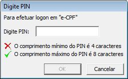



Hto3.X509CertificateHelpers
========================================

[](https://github.com/HTO3/Hto3.X509CertificateHelpers/blob/master/LICENSE)
[](https://www.nuget.org/packages/Hto3.X509CertificateHelpers/)
[](https://www.nuget.org/stats/packages/Hto3.X509CertificateHelpers?groupby=Version)
[](https://github.com/HTO3/Hto3.X509CertificateHelpers/actions/workflows/publish.yml)
[](https://codecov.io/gh/HTO3/Hto3.X509CertificateHelpers)
[](https://www.codacy.com/gh/HTO3/Hto3.X509CertificateHelpers/dashboard?utm_source=github.com&amp;utm_medium=referral&amp;utm_content=HTO3/Hto3.X509CertificateHelpers&amp;utm_campaign=Badge_Grade)

Features
--------
A set of extension methods to help when using X.509 Certificates solving common dev problems.

### VerifyPassword

Verifies if the digital certificate password is correct.

```csharp
var fs = new FileStream(@"C:\mycert.pfx", FileMode.Open);
var pass = "123456";

bool success = X509CertificateHelpers.VerifyPassword(fs, pass);

if (success)
    Console.WriteLine("Good password!");
else
    Console.WriteLine("Wrong password!");
```

### GetExpirationDate

Get the expiration date of a certificate.

```csharp
var fs = new FileStream(@"C:\mycert.pfx", FileMode.Open);
var pass = "123456";

DateTime date = X509CertificateHelpers.GetExpirationDate(fs, pass);

Console.WriteLine($"Expire at {date}");
```

### GetValidUserCertificates

Gets the collection of valid certificates from the currently authenticated user's computer. See more about [X509Certificate2Collection](https://docs.microsoft.com/en-us/dotnet/api/system.security.cryptography.x509certificates.x509certificate2collection).

```csharp
X509Certificate2Collection collection = X509CertificateHelpers.GetValidUserCertificates()
```

### AskForPIN

If necessary, calls the Windows dialog box for the user to enter the digital certificate PIN code. Widely used in A3 digital certificates.



```csharp
var certificate = new X509Certificate2(@"C:\mycert.pfx", "MyPassword");
X509CertificateHelpers.AskForPIN(certificate);
//The thread hang wait until the pin dialog ends.
```

### GetCertificateOwnerName

Get the certificate owner name.

```csharp
var certificate = new X509Certificate2(@"C:\mycert.pfx", "MyPassword");
var ownerName = X509CertificateHelpers.GetCertificateOwnerName(certificate);

Console.WriteLine($"The owner name is {ownerName}");
```

### GetCertificateCPFCNPJ

Tries to get the CPF or CNPJ linked to the digital certificate, if it is not found, null will be returned.

```csharp
var certificate = new X509Certificate2(@"C:\mycert.pfx", "MyPassword");
var cpf_or_cnpj = X509CertificateHelpers.GetCertificateCPFCNPJ(certificate);

Console.WriteLine($"The digital certificate CPF or CNPJ is {cpf_or_cnpj}");
//As is in the certificate, commonly whithout dashes, points or slashes.
```

### SignXML

Sign a XML with a digital certificate.

Assuming the following XML content:

```xml
<?xml version="1.0" encoding="utf-8"?>
<mycontent>
  <description>Bike</description>
  <value>10.87</value>
</mycontent>
```

Then loading to sign:

```csharp
var certificate = new X509Certificate2(@"C:\mycert.pfx", "MyPassword");
string signedXML = X509CertificateHelpers.SignXML(certificate, null, xmlContent);
```

You'll get the result:

```xml
<?xml version="1.0" encoding="utf-8"?>
<mycontent>
  <description>Bike</description>
  <value>10.87</value>
  <Signature
    xmlns="http://www.w3.org/2000/09/xmldsig#">
    <SignedInfo>
      <CanonicalizationMethod Algorithm="http://www.w3.org/TR/2001/REC-xml-c14n-20010315" />
      <SignatureMethod Algorithm="http://www.w3.org/2000/09/xmldsig#rsa-sha1" />
      <Reference URI="">
        <Transforms>
          <Transform Algorithm="http://www.w3.org/2000/09/xmldsig#enveloped-signature" />
          <Transform Algorithm="http://www.w3.org/TR/2001/REC-xml-c14n-20010315" />
        </Transforms>
        <DigestMethod Algorithm="http://www.w3.org/2000/09/xmldsig#sha1" />
        <DigestValue>liQ3R4eGthWfGh6CeqNO1E9WHcE=</DigestValue>
      </Reference>
    </SignedInfo>
    <SignatureValue>dqfa8dfXp2vj+YO3q/aXj4arDKfFSeWP50ZojaqCQvDg0zamj56NEjXEAfHWcdh9D57iPM6CeAECcCrs+Ko3hFCuHrToXAq+/bDUeFqclr0xkCCCxmEKoVhZWA3/4+Sx+521peps0jEuVWBnIr6KQ35BErr35KRSkIJKH9mWsDr3ejQmkh0tbfN3dBU6mvXSYfCfDOZAp/LmHUGElKMm0iqQHN1B6nxeZGYZQhOdz3qxCdpgaaL5yZE8kU69kAfs9GAneJlUylLxQ+AeIC53ZaX+dsi3bCfqP/78g1oFdDrwQFOAda84tjjGCekNzrGsk6UUfu0I0DL7vrvpNZhxMg==</SignatureValue>
    <KeyInfo>
      <X509Data>
        <X509Certificate>MIIEJTCCAw2gAwIBAgIUKl5WD9F/DAw8mSCXhqn619ok3+QwDQYJKoZIhvcNAQELBQAwgaExCzAJBgNVBAYTAkJSMRIwEAYDVQQIDAlTYW8gUGF1bG8xEjAQBgNVBAcMCVNhbyBQYXVsbzEZMBcGA1UECgwQSHRvMyBDb21wYW55IEx0ZDELMAkGA1UECwwCSVQxJDAiBgNVBAMMG015IEZ1bGwgTmFtZToxMjk5MjY2NDAwMDE2MzEcMBoGCSqGSIb3DQEJARYNdGVzdEB0ZXN0LmNvbTAeFw0xOTA4MDMxNzIwNDFaFw0yOTA3MzExNzIwNDFaMIGhMQswCQYDVQQGEwJCUjESMBAGA1UECAwJU2FvIFBhdWxvMRIwEAYDVQQHDAlTYW8gUGF1bG8xGTAXBgNVBAoMEEh0bzMgQ29tcGFueSBMdGQxCzAJBgNVBAsMAklUMSQwIgYDVQQDDBtNeSBGdWxsIE5hbWU6MTI5OTI2NjQwMDAxNjMxHDAaBgkqhkiG9w0BCQEWDXRlc3RAdGVzdC5jb20wggEiMA0GCSqGSIb3DQEBAQUAA4IBDwAwggEKAoIBAQDKVqbEYSyCtH91jhHUz9EJUB7s0hwtllADqGY4E8EnI5E+qTvUNEzdZRRanIo415ZJ/LyT1LM74Q5Oa69kMGjnBgh8QtfSl+iBsMl9bwWX9M9DF9m0RvtLt6F+6e0Mufg3Gd9QkHpMVmUz+noxl7wW2nYlr67nc0fPFpObScJZTqb1CkyozyYH698NTO756AxAg+MSq7yWM1uAAzI6OiecrxwbFL4vriZNxQ8r+3Qq5yqVB7b2ZDqQLLRLRTazve1tbbbIFILv9Im+cFE4IG6a9HiJsm5PAZOJtPjNMNQeeSC383LQz6F16dP6tnpXjp++woZ91Uj5eUWjPvwCViwdAgMBAAGjUzBRMB0GA1UdDgQWBBTRy0ywjQ8UxSl5ej9xLIZqfx9VvTAfBgNVHSMEGDAWgBTRy0ywjQ8UxSl5ej9xLIZqfx9VvTAPBgNVHRMBAf8EBTADAQH/MA0GCSqGSIb3DQEBCwUAA4IBAQCMnGULrDCvSHnlQ1VxVPs7UL2dhXVWW+9vl0Yd0Y78e2X/NMTm2gQeyvU9KbUNl3Y7fydbPUDTQYgLcOv/zAp1CU8euGz/6i7ALibCk6TdVVipiq+MUs6PBcZvxs/kolX3FLkUcSri5FWL3htWLSSsIzqMWKD8UZK2DNDxx8oKu1+LE2Gqh12R4Riqo5TN/DCHMvONdG8WFlxIY7d0Hc24I+L8mlqZiq6ed2kTyC7dRRpsZJchjmuzNC76oBCGbhxgo0qaO8FVBiNwZYThy3xx5aDjgYzAX9yJZVUm6h86DfpBgN8GqBqYu3ilD2dG8+Cl0Ja8Lw/PUN98NLnhkFwT</X509Certificate>
      </X509Data>
    </KeyInfo>
  </Signature>
</mycontent>
```